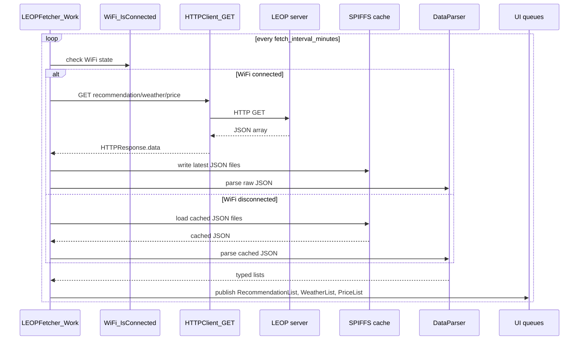
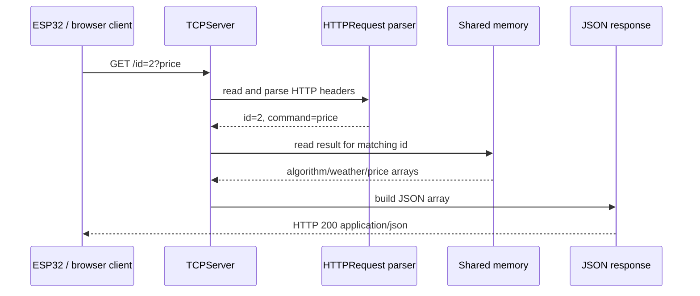

# Glennergy ESP32 API Endpoint Documentation

This document describes the HTTP interface used by the Glennergy ESP32 terminal when communicating with the LEOP server.

Scope:

- External HTTP endpoints used by the ESP32 client.
- Expected JSON formats.
- Cache files connected to each endpoint.
- Client-side error handling in the ESP32 project.

Source basis:

- ESP32 client code in `main/LEOP/LEOP_Fetcher.c`, `main/HTTP.c`, `main/LEOP/*.c`, and `main/JSONParser/DataParser.c`.
- Server code in `Glennergy-Optimizer/glennergy` branch `fixed`, especially `Server/Connection/Connection.c` and `Server/HTTP/HTTPRequest.c`.
- The local ESP repository is on branch `dev` and its remote is `https://github.com/Glennergy-Optimizer/Glennergy-ESP.git`.

Note: The ESP32 client currently treats the server API as a simple HTTP JSON source. It does not send request bodies or authentication headers.

## Base URL

```text
http://31.59.105.197
```

Defined in:

```c
#define LEOP_SERVER_URL "http://31.59.105.197"
```

## Endpoint Summary

| Endpoint | Method | Purpose | Parser | Cache file |
| --- | --- | --- | --- | --- |
| `/id=2?recommendation` | `GET` | Fetches recommendation values for the electricity view. | `DataParser_ParseRecommendation` | `Recommendations.json` |
| `/id=2?weather` | `GET` | Fetches weather forecast values for the weather view. | `DataParser_ParseWeather` | `Weather.json` |
| `/id=2?price` | `GET` | Fetches electricity price values for the price view. | `DataParser_ParsePrice` | `Price.json` |

All endpoints are expected to return a JSON array, normally with up to 96 entries.

## Common Request Format

The ESP32 sends all endpoint requests in the same way:

```text
Method: GET
Headers: none explicitly configured
Body: none
Transport: HTTP
```

Server-side request parsing:

- The server accepts `GET` and `OPTIONS`.
- The request path is expected to contain `=`.
- The part after `=` is extracted as the internal request string.
- `parse_request()` reads the leading number as `id`.
- If a `?` exists, the part after it becomes `command`.

Example:

```text
GET /id=2?weather HTTP/1.1
```

is interpreted by the server as:

```text
id = 2
command = weather
```

The HTTP client stores the response body dynamically in:

```c
typedef struct
{
    char* data;
    size_t length;
} HTTPResponse;
```

## Common Successful Response Requirements

The parser expects:

- Response body is valid JSON.
- Top-level JSON value is an array.
- Array is not empty.
- Each object contains the fields required by that endpoint.
- `timestamp` is a string small enough to fit in a `char timestamp[20]` buffer.

The client code currently does not validate every field before reading it, so the server should always include the documented fields.

The server response wrapper is:

```text
HTTP/1.1 200 OK
Content-Length: <json length>
Content-Type: application/json
Access-Control-Allow-Origin: *
Access-Control-Allow-Methods: GET, OPTIONS
Access-Control-Allow-Headers: Content-Type
Connection: close
```

Special server responses:

| Request | Response |
| --- | --- |
| `/favicon.ico` | `HTTP 204 No Content` |
| `/` or missing parsed URL | `HTTP 204 No Content` |

## 1. Recommendation Endpoint

```text
Endpoint: GET /id=2?recommendation
```

Description:

Fetches recommendation values used by the electricity recommendation chart.

Full URL:

```text
http://31.59.105.197/id=2?recommendation
```

Successful response:

```text
HTTP 200
Content-Type: application/json
```

Body:

```json
[
  {
    "id": 1,
    "type": 0.72,
    "timestamp": "2026-06-09T12:00:00"
  }
]
```

Field contract:

| Field | Type | Required | Used as |
| --- | --- | --- | --- |
| `id` | integer | Yes | `Recommendation.id` |
| `type` | number | Yes | `Recommendation.recommendation` |
| `timestamp` | string | Yes | `Recommendation.timestamp` |
| `temp` | number | Server includes it | Ignored by current ESP recommendation parser |

Client storage:

```c
typedef struct{
    int id;
    double recommendation;
    char timestamp[20];
} Recommendation;
```

Client success path:

1. `Recommendation_Fetch()` calls `HTTPClient_GET()`.
2. Response JSON is written to `Recommendations.json`.
3. `DataParser_ParseRecommendation()` parses the response into `RecommendationList`.
4. `LEOPFetcher_Work()` publishes the list to `recommendation_queue`.
5. `Electricity_UI_Update()` consumes the queue and updates the chart.

Client error handling:

| Condition | Client behavior |
| --- | --- |
| HTTP response body is `NULL` | `Recommendation_Fetch()` returns `1`, status becomes not fetched. |
| Cache write fails | Warning is logged, but parsing continues. |
| JSON parse fails | `Recommendation_Fetch()` returns `2`, status becomes not fetched. |
| Top-level JSON is not an array | Parser returns `2`. |
| Array is empty | Parser returns `3`. |
| Queue send fails | Warning is logged; fetched data remains in `app.leop_data`. |

Offline fallback:

If WiFi is disconnected, `Recommendation_FetchCache()` reads:

```text
/spiffs/Recommendations.json
```

## 2. Weather Endpoint

```text
Endpoint: GET /id=2?weather
```

Description:

Fetches weather forecast values used by the weather dashboard.

Full URL:

```text
http://31.59.105.197/id=2?weather
```

Successful response:

```text
HTTP 200
Content-Type: application/json
```

Body:

```json
[
  {
    "temp": 18.4,
    "uv_index": 3,
    "weather_code": 2,
    "timestamp": "2026-06-09T12:00:00"
  }
]
```

Field contract:

| Field | Type | Required | Used as |
| --- | --- | --- | --- |
| `temp` | number | Yes | `Weather.temp` |
| `uv_index` | number/integer | Yes | `Weather.uv_index` |
| `weather_code` | integer | Yes | `Weather.weather_code` |
| `timestamp` | string | Yes | `Weather.timestamp` |

Client storage:

```c
typedef struct
{
    float temp;
    int uv_index;
    int weather_code;
    char timestamp[20];
} Weather;
```

Client success path:

1. `Weather_Fetch()` calls `HTTPClient_GET()`.
2. Response JSON is written to `Weather.json`.
3. `DataParser_ParseWeather()` parses the response into `WeatherList`.
4. `LEOPFetcher_Work()` publishes the list to `weather_queue`.
5. `Weather_UI_Update_test()` consumes the queue and updates weather widgets.

Client error handling:

| Condition | Client behavior |
| --- | --- |
| HTTP response body is `NULL` | `Weather_Fetch()` returns `1`, status becomes not fetched. |
| Cache write fails | Warning is logged, but parsing continues. |
| JSON parse fails | `Weather_Fetch()` returns `2`, status becomes not fetched. |
| Top-level JSON is not an array | Parser returns `2`. |
| Array is empty | Parser returns `3`. |
| Queue send fails | Warning is logged; fetched data remains in `app.leop_data`. |

Offline fallback:

If WiFi is disconnected, `Weather_FetchCache()` reads:

```text
/spiffs/Weather.json
```

## 3. Price Endpoint

```text
Endpoint: GET /id=2?price
```

Description:

Fetches electricity price values used by the price list.

Full URL:

```text
http://31.59.105.197/id=2?price
```

Successful response:

```text
HTTP 200
Content-Type: application/json
```

Body:

```json
[
  {
    "price SEK": 0.94,
    "timestamp": "2026-06-09T12:00:00"
  }
]
```

Field contract:

| Field | Type | Required | Used as |
| --- | --- | --- | --- |
| `price SEK` | number | Yes | `Price.current_prices` |
| `timestamp` | string | Yes | `Price.timestamp` |

Client storage:

```c
typedef struct
{
    double current_prices;
    char timestamp[20];
} Price;
```

Client success path:

1. `Price_Fetch()` calls `HTTPClient_GET()`.
2. Response JSON is written to `Price.json`.
3. `DataParser_ParsePrice()` parses the response into `PriceList`.
4. `LEOPFetcher_Work()` publishes the list to `price_queue`.
5. `Price_UI_Update()` consumes the queue and updates the price list.

Client error handling:

| Condition | Client behavior |
| --- | --- |
| HTTP response body is `NULL` | `Price_Fetch()` returns `1`, status becomes not fetched. |
| Cache write fails | Warning is logged, but parsing continues. |
| JSON parse fails | `Price_Fetch()` returns `2`, status becomes not fetched. |
| Top-level JSON is not an array | Parser returns `2`. |
| Array is empty | Parser returns `3`. |
| Queue send fails | Warning is logged; fetched data remains in `app.leop_data`. |

Offline fallback:

If WiFi is disconnected, `Price_FetchCache()` reads:

```text
/spiffs/Price.json
```

## Client Fetch Flow



## Error Handling Summary

## Server-Side Behavior Summary

Implemented mainly in the external server repository:

- `Server/HTTP/HTTPRequest.c`
- `Server/Connection/Connection.c`
- `Server/TCPServer.c`

The server runs a non-blocking TCP server, accepts connections, parses HTTP headers, reads an ID and command from the request, then reads algorithm results from shared memory and serializes a JSON array.

High-level flow:



Server command handling:

| Command | Server output |
| --- | --- |
| `recommendation` | 96 objects with `id`, `type`, `timestamp`, and `temp`. |
| `weather` | 96 objects with `timestamp`, `temp`, `weather_code`, and `uv_index`. |
| `price` | 96 objects with `timestamp` and `price SEK`. |
| Other / unknown command | Empty JSON array, because no command branch appends objects. |

Server error/edge behavior:

| Condition | Server behavior observed in code |
| --- | --- |
| Unsupported HTTP method | Header parser returns failure. |
| Header line endings invalid | Header parser returns failure. |
| Missing `=` in request line | Header parser returns failure. |
| `/favicon.ico` | Sends `204 No Content`. |
| `/` or parsed URL is missing | Sends `204 No Content`. |
| No matching building ID | Sends `200 OK` with an empty JSON array. |
| Unknown command | Sends `200 OK` with an empty JSON array. |
| Response larger than 30000-byte buffer | Logs truncation error and returns failure. |

Client impact:

- Empty arrays are rejected by the ESP parser with return code `3`.
- Server error JSON objects would be rejected because the ESP parser requires a top-level array.
- Unknown commands or unknown IDs therefore appear to the ESP as parse failures, not as explicit HTTP errors.

## Client-Side Error Handling Summary

### HTTP layer

Implemented in `main/HTTP.c`.

| Error source | Current handling |
| --- | --- |
| WiFi not connected | `HTTPClient_GET()` does not perform a request. |
| HTTP client init fails | Error is logged, response body remains unset. |
| `esp_http_client_perform()` fails | Error is logged. |
| HTTP status is non-200 | Status is logged, but the status code is not currently used to reject the response. |
| Response allocation fails | Event handler logs allocation failure and returns `ESP_FAIL`. |

Important note:

The current client logs HTTP status code and content length, but endpoint success is effectively determined by whether a non-NULL body can be parsed successfully.

### Parser layer

Implemented in `main/JSONParser/DataParser.c`.

| Return value | Meaning |
| --- | --- |
| `0` | Parse success |
| `1` | `json_loads()` failed; invalid JSON or empty input |
| `2` | Top-level JSON value is not an array |
| `3` | Array is empty |

### LEOP category fetch layer

Implemented in:

- `main/LEOP/Recommendation.c`
- `main/LEOP/Weather.c`
- `main/LEOP/Price.c`

| Return value | Meaning |
| --- | --- |
| `0` | Fetch/cache parse success |
| `1` | Invalid HTTP response or failed cache load |
| `2` | JSON parse failure |

### LEOP fetcher task layer

Implemented in `main/LEOP/LEOP_Fetcher.c`.

| Condition | Current behavior |
| --- | --- |
| WiFi connected | Fetches all three endpoints over HTTP. |
| WiFi disconnected | Loads all three data categories from cache. |
| Individual category fetch fails | Category status flag is set to false. |
| Queue send fails | Warning is logged. |
| Offline mode | Retries after 3 seconds. |
| Online mode | Waits `fetch_interval_minutes` before next cycle. |

## Status Flags

Each data category has its own status flag:

| Data category | Status field |
| --- | --- |
| Recommendation | `RecommendationList.status.recommendation_fetched` |
| Weather | `WeatherList.status.weather_fetched` |
| Price | `PriceList.status.electricity_fetched` |

The UI checks these status fields before updating.

## Known Limitations / Improvement Points

These are useful to mention during review because they show that the API contract is understood.

1. HTTP status codes are logged but not used for validation.
2. The client assumes required JSON fields exist.
3. `timestamp` buffers are 20 bytes, so timestamp strings must stay short.
4. Queue capacity is 1; LEOP queue sends can fail if the UI has not consumed old data.
5. Cache write failure does not stop parsing, which is good for live data but means offline fallback may later use stale data.
6. `price SEK` contains a space, so the server and client must preserve that exact field name.

## Recommended Server Contract

For future server work, each endpoint should guarantee:

- `HTTP 200` with `Content-Type: application/json` on success.
- A JSON array as top-level response.
- Up to 96 entries per response.
- Required fields exactly as documented above.
- ISO-like timestamp strings that fit in the ESP32 timestamp buffers.
- Stable field names, especially `price SEK`.

Recommended error responses:

```text
HTTP 500: Internal server error
HTTP 503: Data temporarily unavailable
HTTP 404: Unknown endpoint
```

Recommended error body:

```json
{
  "error": "data_unavailable",
  "message": "Weather data is not ready yet"
}
```

Current ESP32 behavior for these errors:

- If the response body is not a valid array, parser fails.
- If WiFi is disconnected, cache fallback is used.
- If WiFi is connected but server returns an error JSON object, cache fallback is not automatically used in the current online branch.

## Compatibility Notes Between Server and ESP32 Client

| Topic | Current status |
| --- | --- |
| URL shape | ESP uses `/id=2?command`, matching the server parser expectation of an `=` followed by ID and optional `?command`. |
| Recommendation fields | Server includes `temp`, but ESP ignores it for recommendations. Compatible. |
| Weather `uv_index` | Server writes `uv_index` as JSON real; ESP reads it as integer. Compatible if values are integer-like, but should be standardized. |
| Error signaling | Server often returns `200 OK` with an empty array for unknown IDs/commands. ESP treats empty arrays as parse failure. |
| HTTP status validation | ESP logs status code but does not reject based on non-200 status. |
| Cache fallback | ESP falls back to cache when WiFi is disconnected. It does not automatically fall back when WiFi is connected but server returns empty/invalid data. |
